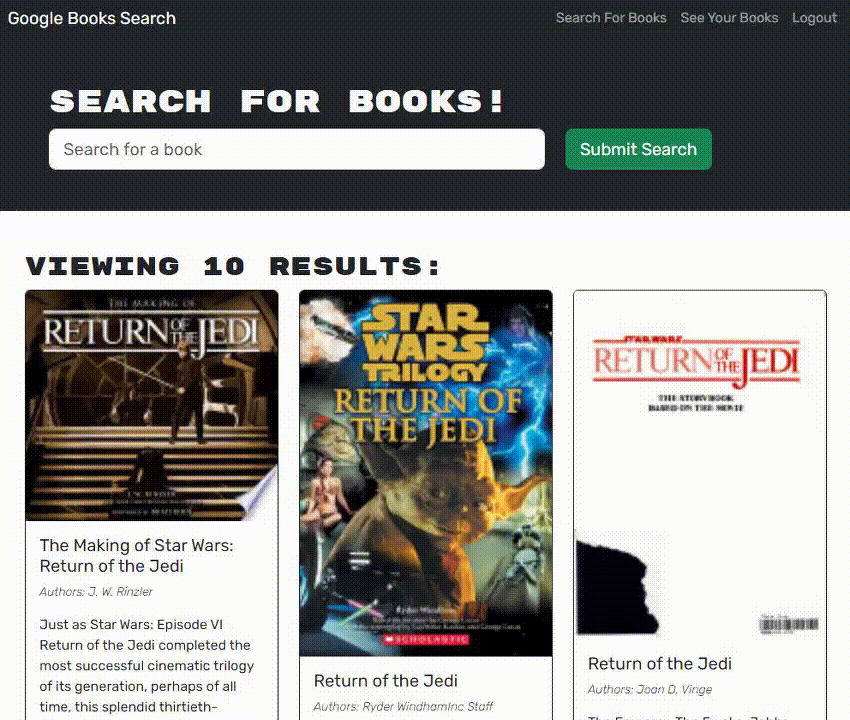

# Book Search Engine (MERN Refactor)

## Description

Refactor of a book search engine from a RESTful API to Apollo Server and GraphQL.

I wanted to become more proficient in using Apollo Server and GraphQL and refactoring an already fully functioning RESTful API application to be a GraphQL API based application was a great way to do so.

## Installation

If you want to deploy this app locally you'll need to do the following:

* Clone the repository to you local machine
* Type `npm install` in the terminal to install dependencies
* Type `npm run develop` in the terminal to run the local server
* Navigate to `http://localhost:3000/` in your browser (this should open automatically)

## Usage

This app is deployed on Heroku, the link can be found here: [Click Me!](http://www.google.com)

There are five basic functions of this application:

* Create a new account
* Sign in to an existing account
* Log out if already signed in
* Search for and add books to your account
* Remove books from your account

---

### Login / Sign Up / Logout

A user can create a new account or sign in to an existing account by clicking the 'Login/Sign Up' text at the top right of the viewport. When a user is signed in this text is replace by 'Logout' text which can also be clicked to perform the corresponding action.

---

### Search / Save

A user can search for books by typing their search criteria in the input field and clicking the 'Submit Search' button. The page will then be populated using the Google Books API.

If a user is not currently logged in they can still search for books, but there will not be buttons below each result to 'Save this book!'.

---

### Delete

While logged in and after saving a book a user can click the 'See Your Books' text at the top right of the viewport to be taken to their saved books. From there they can click the 'Delete This Book!' button to remove that saved book from their account.

## Technologies

* [apollo/server](https://www.npmjs.com/package/@apollo/server) - GraphQL server that allows the use of GraphQL API.
* [graphql](https://www.npmjs.com/package/graphql) - Query Language for APIs.
* [express](https://www.npmjs.com/package/express) - Web Framework.
* [bcrypt](https://www.npmjs.com/package/bcrypt) - Library to hash passwords.
* [jsonwebtoken](https://www.npmjs.com/package/jsonwebtoken) - User verification for various functions.
* [mongodb](https://www.npmjs.com/package/mongodb) - Document-oriented database program.
* [mongoose](https://www.npmjs.com/package/mongoose) - MongoDB object modeling tool.
* [nodemon](https://www.npmjs.com/package/nodemon) - Simple monitor script for Node.js.
* [react](https://www.npmjs.com/package/react) - JavaScript Library for creating user interfaces.
* [react-dom](https://www.npmjs.com/package/react-dom) - React package for working with the DOM.
* [vitejs](https://www.npmjs.com/package/@vitejs/plugin-react) - Plugin for React, enables use of Babel and hot module reloading.
* [eslint](https://www.npmjs.com/package/eslint) - Tool  for identifying potential issues in code.
